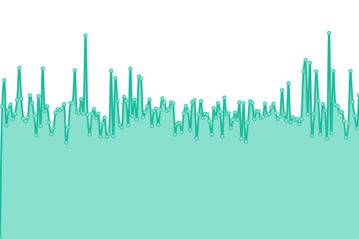
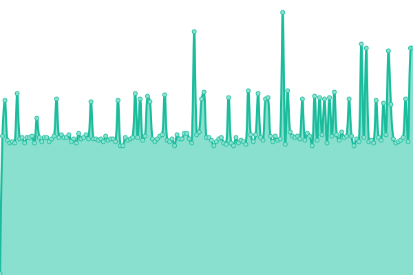
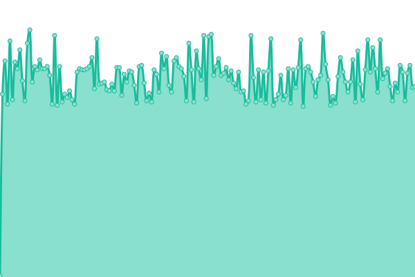
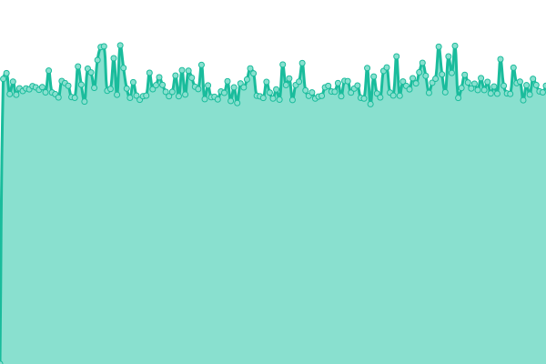
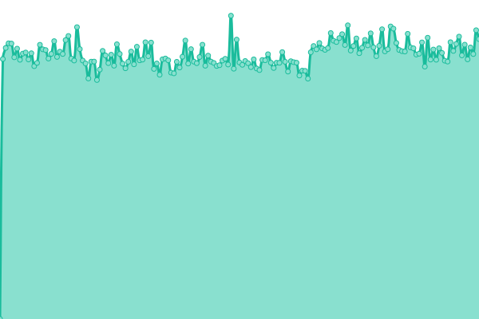
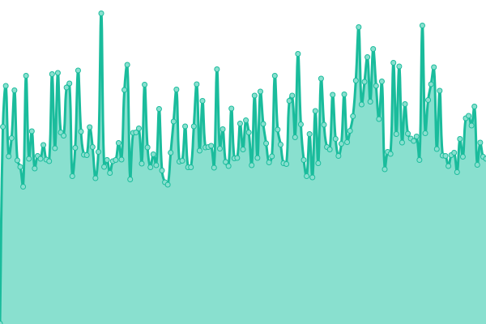
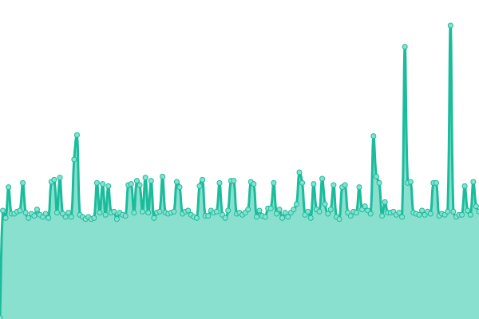
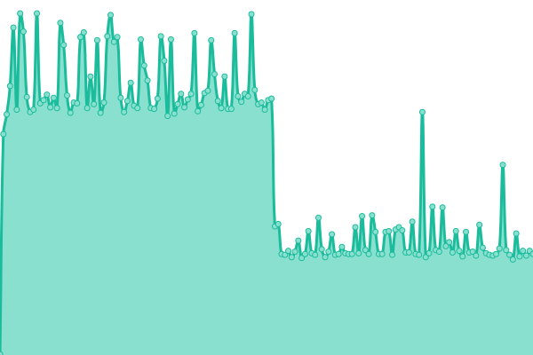

# [📈 Live Status](https://factiverse.github.io/api-upptime): <!--live status--> **🟨 Degraded performance**

This repository contains the open-source uptime monitor and status page for [Factiverse](https://factiverse.github.io/api-upptime), powered by [Upptime](https://github.com/upptime/upptime).

With [Upptime](https://upptime.js.org), you can get your own unlimited and free uptime monitor and status page, powered entirely by a GitHub repository. We use [Issues](https://github.com/factiverse/api-upptime/issues) as incident reports, [Actions](https://github.com/factiverse/api-upptime/actions) as uptime monitors, and [Pages](https://factiverse.github.io/api-upptime) for the status page.

<!--start: status pages-->
<!-- This summary is generated by Upptime (https://github.com/upptime/upptime) -->
<!-- Do not edit this manually, your changes will be overwritten -->
<!-- prettier-ignore -->
| URL | Status | History | Response Time | Uptime |
| --- | ------ | ------- | ------------- | ------ |
|  [GET to /dummy](https://dev.factiverse.no/v1/dummy) | 🟩 Up | [get-to-dummy.yml](https://github.com/factiverse/upptime-dev/commits/HEAD/history/get-to-dummy.yml) | 

 702ms
     
 | 

<a href="https://factiverse.github.io/upptime-prod/history/get-to-dummy">40.99%</a>
    

|  [POST to /dummy](https://dev.factiverse.no/v1/dummy) | 🟩 Up | [post-to-dummy.yml](https://github.com/factiverse/upptime-dev/commits/HEAD/history/post-to-dummy.yml) | 

 112ms
     
 | 

<a href="https://factiverse.github.io/upptime-prod/history/post-to-dummy">85.72%</a>
    

|  [POST to /bias_detection](https://dev.factiverse.no/v1/bias_detection) | 🟩 Up | [post-to-bias-detection.yml](https://github.com/factiverse/upptime-dev/commits/HEAD/history/post-to-bias-detection.yml) | 

 195ms
     
 | 

<a href="https://factiverse.github.io/upptime-prod/history/post-to-bias-detection">57.64%</a>
    

|  [POST to /stance_detection](https://dev.factiverse.no/v1/stance_detection) | 🟩 Up | [post-to-stance-detection.yml](https://github.com/factiverse/upptime-dev/commits/HEAD/history/post-to-stance-detection.yml) | 

 5940ms
     
 | 

<a href="https://factiverse.github.io/upptime-prod/history/post-to-stance-detection">57.05%</a>
    

|  [POST to /claim_detection](https://dev.factiverse.no/v1/claim_detection) | 🟩 Up | [post-to-claim-detection.yml](https://github.com/factiverse/upptime-dev/commits/HEAD/history/post-to-claim-detection.yml) | 

 189ms
     
 | 

<a href="https://factiverse.github.io/upptime-prod/history/post-to-claim-detection">16.03%</a>
    

|  [POST to /fact_check](https://dev.factiverse.no/v1/fact_check) | 🟨 Degraded | [post-to-fact-check.yml](https://github.com/factiverse/upptime-dev/commits/HEAD/history/post-to-fact-check.yml) | 

 17775ms
     
 | 

<a href="https://factiverse.github.io/upptime-prod/history/post-to-fact-check">14.09%</a>
    

|  [POST to /search](https://dev.factiverse.no/v1/search) | 🟨 Degraded | [post-to-search.yml](https://github.com/factiverse/upptime-dev/commits/HEAD/history/post-to-search.yml) | 

 1818ms
     
 | 

<a href="https://factiverse.github.io/upptime-prod/history/post-to-search">16.94%</a>
    

|  [POST to /feedback](https://dev.factiverse.no/v1/feedback) | 🟩 Up | [post-to-feedback.yml](https://github.com/factiverse/upptime-dev/commits/HEAD/history/post-to-feedback.yml) | 

 113ms
     
 | 

<a href="https://factiverse.github.io/upptime-prod/history/post-to-feedback">85.70%</a>
    

|  [POST to /auth/login](https://dev.factiverse.no/v1/auth/login) | 🟩 Up | [post-to-auth-login.yml](https://github.com/factiverse/upptime-dev/commits/HEAD/history/post-to-auth-login.yml) | 

 114ms
     
 | 

<a href="https://factiverse.github.io/upptime-prod/history/post-to-auth-login">11.79%</a>
    

<!--end: status pages-->

[**Visit our status website →**](https://factiverse.github.io/api-upptime)

## 📄 License

- Powered by: [Upptime](https://github.com/upptime/upptime)
- Code: [MIT](./LICENSE) © [Factiverse](https://factiverse.github.io/api-upptime)
- Data in the `./history` directory: [Open Database License](https://opendatacommons.org/licenses/odbl/1-0/)
